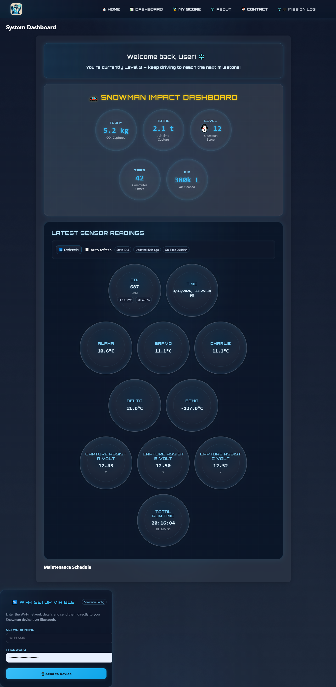

# ❄️ Project Snowman Companion App


---

## 📸 Preview



> Real-time IoT telemetry dashboard with BLE device configuration and resilient data handling.

---

## 🧠 Overview

Project Snowman Companion App is a monitoring and engagement platform designed to support a modular environmental system through real-time telemetry, user interaction, and data visualization.

The app provides insight into system performance, tracks environmental impact, and introduces interactive elements to encourage sustained engagement.

> ⚠️ Note: Implementation details are intentionally abstracted.

---

## 🚀 Tech Stack

- **Frontend:** React + Vite  
- **Backend:** Node.js / Express  
- **Database:** MongoDB  
- **Deployment:** Netlify (frontend), Render (backend)  
- **Hardware:** ESP32-based telemetry + BLE configuration interface  

---

### 🔧 Core Features

📊 System Monitoring
Live telemetry dashboard
Multi-sensor data visualization (temperature, voltage, environmental metrics)
Derived system state (ACTIVE / IDLE) based on real-world conditions
Runtime tracking with dynamic session accumulation
Smart fallback to cached readings when device is unavailable

---

### 📡 Device Interaction (BLE)

Direct Wi-Fi configuration via Bluetooth
Secure credential transmission to device
Real-time connection status feedback
Graceful error handling for connection failures

---

### 🌱 Environmental Tracking

- Environmental impact tracking and visualization
- Aggregated performance metrics over time
- Comparative insights for contextual understanding

---

### 🎮 Gamification Layer

- Scoring system based on system activity
- Achievements and milestones
- Engagement-based progression model

---

### 🌍 Awareness & Insights

- External environmental data integration (planned)
- Educational content and system context
- Community and update feeds (planned)

---

### 🔌 Integration & Expansion

- Designed for modular system expansion
- Future support for connected devices and external systems
- Scalable architecture for multi-unit environments

---

### 🧪 Tested Flows

Frontend test coverage validating real-world device interaction and fallback behavior.

Cached telemetry rendering from session storage
Refresh request behavior with firmware-triggered data flow
Graceful fallback when no new device reading is available
Failed refresh handling with system resilience
Auto-refresh toggle behavior
BLE Wi-Fi credential setup flow
SSID and password validation
Web Bluetooth availability handling
Successful BLE credential transmission
BLE failure and error handling

---


### 🧠 System Behavior Highlights

- Designed to operate reliably even when the physical device is offline

Hardware-aware UI: adapts based on device availability
Resilient data model: always shows last known good state
Asynchronous telemetry pipeline: handles delayed device responses
State derivation logic: combines sensor freshness + voltage activity

---

## 🧪 Future Direction

- Simulation and predictive modeling
- Visual system representations (AR/3D)
- Expanded data integrations and analytics
- Enhanced user interaction systems

---

## 🏗️ Architecture (High-Level)


Sensors → ESP32 → Backend API → Dashboard UI


- Sensor data is collected and transmitted via embedded hardware
- Backend processes and exposes telemetry data
- Frontend visualizes data in real time

---

## 📁 Project Structure


/src
/components
/pages
/services
App.jsx
main.jsx


---

## 🧭 Current Status

- [x] System rebuild and sensor integration complete  
- [x] Live telemetry pipeline operational  
- [x] Dashboard displaying real-time data  
- [ ] Backend expansion and data persistence enhancements  
- [ ] Advanced analytics and feature layering  

---

## 🎯 Why This Project Matters

This project explores the intersection of:
- IoT telemetry systems  
- real-time data visualization  
- environmental monitoring  
- user engagement design  

It demonstrates a full-stack approach to building connected systems that bridge hardware and software.

---

## ⚙️ Run Locally

```bash
npm install
npm run dev
🌐 Deployment
Frontend: Netlify
Backend: Render

Building connected systems that turn data into insight. ❄️


